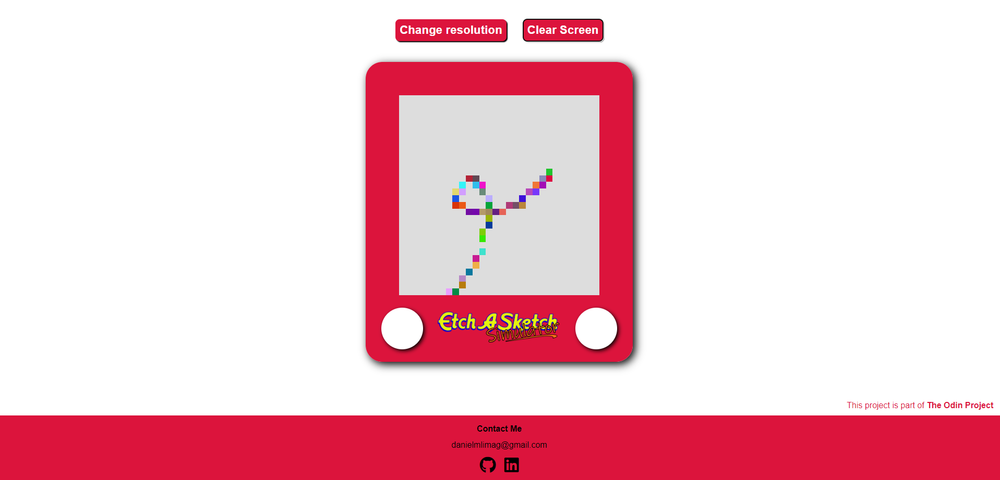

# Etch a Sketch

## Introduction

This is a Web version of the old mechanical drawing toy Etch a Sketch,  
built with plain HTML, CSS and Javascript and it is part of [The Odin Project](https://www.theodinproject.com/).

## Screenshot

## Visualize WebPage

This project is hosted in my GitHub Pages and you can access it [in here](https://daniellima0.github.io/etch-a-sketch/).
